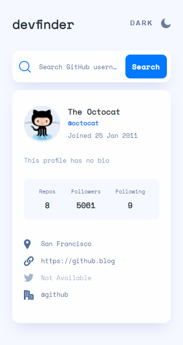

# Frontend Mentor - GitHub user search app solution

This is a solution to the [GitHub user search app challenge on Frontend Mentor](https://www.frontendmentor.io/challenges/github-user-search-app-Q09YOgaH6). Frontend Mentor challenges help you improve your coding skills by building realistic projects.

## Table of contents

- [Overview](#overview)
  - [The challenge](#the-challenge)
  - [Screenshot](#screenshot)
  - [Links](#links)
- [My process](#my-process)
  - [Built with](#built-with)
  - [What I learned](#what-i-learned)
  - [Continued development](#continued-development)
- [Author](#author)
- [Acknowledgments](#acknowledgments)

## Overview

### The challenge

Users should be able to:

- View the optimal layout for the app depending on their device's screen size
- See hover states for all interactive elements on the page
- Search for GitHub users by their username
- See relevant user information based on their search
- Switch between light and dark themes

### Screenshot




### Links

- Solution URL: [Github repo](https://github.com/KarolisGaiv/github-search)
- Live Site URL: [Check it out live!](https://karolisgaiv.github.io/github-search/)

## My process

### Built with

- Semantic HTML5 markup
- CSS custom properties
- BEM
- Flexbox
- CSS Grid
- Mobile-first workflow
- [React](https://reactjs.org/) - JS library

### What I learned

Second project where I've started with Mobile-first workflow. Was a really good practice until I saw how application looks like on desktop view. This just proved that it is better to spend more time with a blank sheet of paper and thinking about whole project, it's structure and components instead of jumping straight to coding.

Besides that, I've improved my skills working with CSS Grid. I've tried to do everything with just plain Flexbox, but CSS Grid is more suitable for element layout. I finally understood how I can manipulate element positioning in the grid by using grid-area property

```css
&__contact-details {
  grid-area: 4/1/4/3;
  list-style: none;
}
```

### Continued development

For my next project I would like to spend more time developing project structure before I start coding. In my opinion this could save a lot of time and pain. Besides that, work with svg and images could be another area of improvement.

## Author

- Website - [Karolis G](https://github.com/KarolisGaiv/github-search)
- Frontend Mentor - [@KarolisGaiv](https://www.frontendmentor.io/profile/KarolisGaiv)
